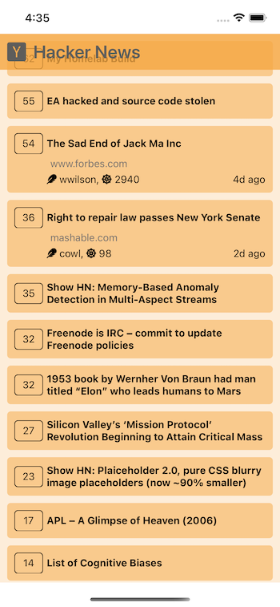

### Mini Hacker News App

This is a simple Hacker News Client App on React Native.
{ width=45% }
{ width=45% }
{ width=45% }

## Features
- The news list page contains a list of hacker news
- Random, sorted by score, 30 maximum news
- Click the news ticket to see author name, karma, time
- Show the time ago ( such as '2 days ago', '3 mins ago' )

## Topic
- My own light version of redux with context API for state management
- React Hooks
- Hackernews API

## Dependencies
- axios 0.21.1
- react 17.0.1
- react-native 0.64.1
- react-native-vector-icons 8.1.0

## How to run
1. Clone the repo
``` 
git clone https://github.com/FrozenIce0617/hackernews-app.git 
```

2. Install dependencies
```
yarn
```

3. Run project
```
yarn start
```